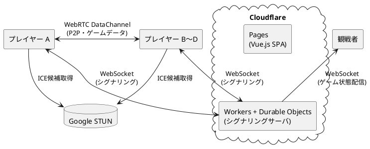

# Any Style Mahjong

WebRTC P2P 通信を使ったリアルタイム麻雀テーブルゲーム。

## アーキテクチャ



| レイヤー | 技術 | ホスティング |
|---------|------|------------|
| フロントエンド | Vue.js | Cloudflare Pages |
| シグナリングサーバ | Cloudflare Workers + Durable Objects | Cloudflare (無料枠) |
| プレイヤー間通信 | WebRTC DataChannel (P2P) | - |
| 観戦者への配信 | WebSocket (サーバ中継) | - |
| STUN | Google STUN (`stun.l.google.com:19302`) | 無料 |

## ディレクトリ構成

```
.
├── .devcontainer/
│   ├── Dockerfile          # wrangler 実行環境
│   └── docker-compose.yml
├── worker/                 # シグナリングサーバ (Cloudflare Workers)
│   ├── src/
│   │   ├── index.ts        # エントリポイント・ルーティング
│   │   └── room.ts         # Durable Object（ルーム管理）
│   └── wrangler.toml
├── frontend/               # Vue.js フロントエンド
│   └── src/
├── .gitignore
├── LICENSE
└── README.md
```

## 開発環境のセットアップ

### 必要なもの

- Docker / Docker Compose（wrangler 実行用）
- Cloudflare アカウント

### 環境変数の設定

プロジェクトの **1つ上の階層** に `.env` ファイルを作成（リポジトリ外に置くことで誤コミットを防ぐ）:

```env
CLOUDFLARE_API_TOKEN=your_cloudflare_api_token
CLOUDFLARE_ACCOUNT_ID=your_cloudflare_account_id
```

Cloudflare API トークンは [Cloudflare Dashboard](https://dash.cloudflare.com/profile/api-tokens) で発行してください。  
必要な権限: `Workers Scripts:Edit`, `Workers KV Storage:Edit`

### wrangler コマンドの実行

```bash
# イメージのビルド（初回のみ）
docker compose -f .devcontainer/docker-compose.yml build

# シグナリングサーバのローカル開発
docker compose -f .devcontainer/docker-compose.yml run --rm wrangler wrangler dev

# シグナリングサーバのデプロイ
docker compose -f .devcontainer/docker-compose.yml run --rm wrangler wrangler deploy

# フロントエンドのデプロイ (Cloudflare Pages)
docker compose -f .devcontainer/docker-compose.yml run --rm wrangler wrangler pages deploy dist
```

## ルーム仕様

- 1ルームあたりプレイヤー: 2〜4人
- 観戦者: 制限なし（WebSocket でゲーム状態を受信）
- 同時接続想定: 10名程度
